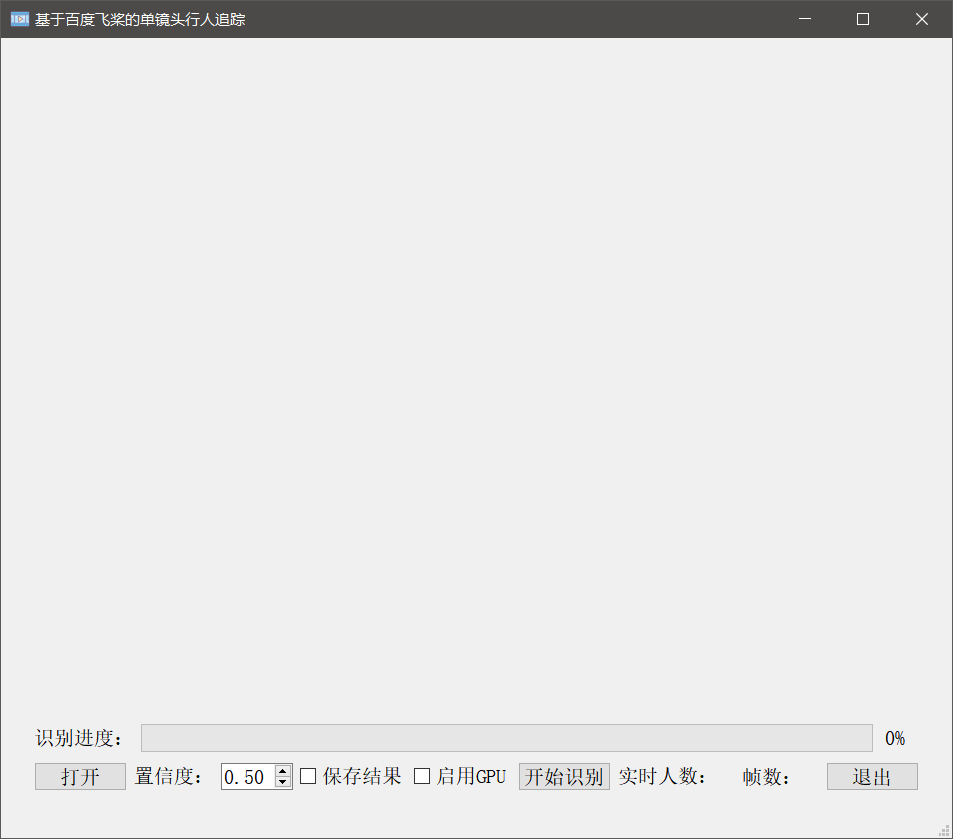
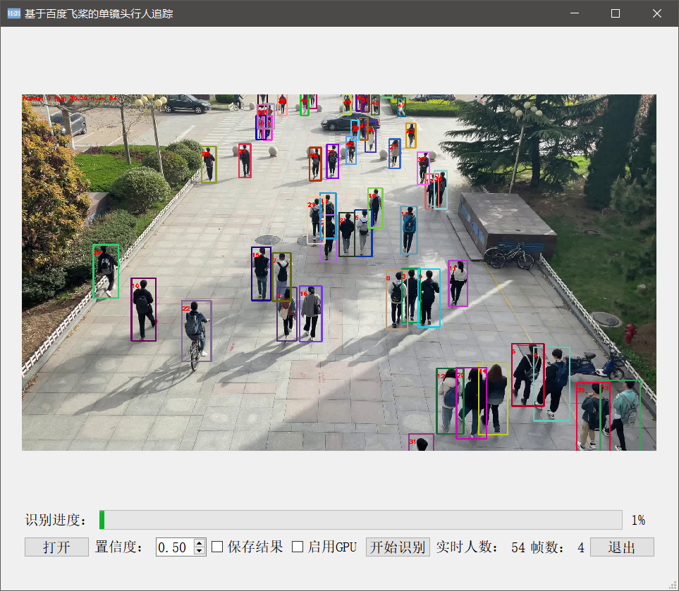

AIstudio项目地址：https://aistudio.baidu.com/aistudio/projectdetail/2072085

## 1 JDE追踪算法

### 1.1 简介

- Jointly learns the Detector and Embedding model (JDE)，是一类追踪算法的总称。该范式首先通过检测器（detector）检测出画面中物体所在的检测框，然后根据物体检测框移动的规律（运动特征）和检测框中物体的外观特征（通常通过一个ReID网络抽取一个低维的向量，叫做embedding向量）来进行前后帧同一物体的匹配，从而实现多目标追踪。
- 若将MOT分为了两步，即

（1）物体检测

（2）特征提取与物体关联

- 该类方法检测与特征提取是分开的，所以又被称为SDE（Separate Detection and Embedding），SDE存在的最大缺点就是速度慢，因为将物体检测和（外观）特征提取分开，检测速度自然就下去了。

### 1.2 JDE的网络结构和损失函数

- 该方法是基于One-stage检测器学习到物体的embedding的（代码中采用的是经典的YOLO V3模型）。那么JDE范式就应该在检测器的输出（head），多输出一个分支用来学习物体的embedding的。结构如下图:


- FPN网络产出Prediction head，在Prediction head中多出来了一个分支用于输出embedding。然后使用一个多任务学习（multi-task learning）的思路设置损失函数。

### 1.3 embedding操作方法

- 对embedding进行转化，转化为足够强的语义信息，也就是这个embedding到底属于哪个track ID的物体，那么这种就需要借鉴物体分类的思路了（将每个track ID当作一个类别），所以作者引入了全连接层将embedding信息转化为track ID分类信息，如下图。


### 1.4 小结

JDE是一个网络同时输出图像画面中的检测框位置和检测框内物体的embedding，加速MOT的速度。JDE只是同时输出了检测框和embedding信息。后面还是要通过卡尔曼滤波和匈牙利算法进行目标的匹配。

##2 FairMOT

### 2.1 简介

- 其实FairMOT属于JDE（Jointly learns the Detector and Embedding model ）的一种。实验证明了现有的JDE方法存在一些不足，FairMOT根据这些不足进行了相关的改进

### 2.2 JDE方法存在的问题

- Anchor-Based 的检测器不适用JDE追踪模式，如下图


（1）一个物体可能被多个anchor负责并进行检测，这会导致严重的网络模糊性。

（2）实际物体的中心可能与负责对该物体进行检测的anchor中心有偏差。

- 缺少多层特征融合

Re-ID信息不能仅仅包含高层网络中的语义信息，也要适度包含低层网络中的的颜色，纹理的信息。

- Re-ID存储维度选择

MOT的一些benchmarks中并没有那么像Re-ID那么多的数据，维度设置大了容易过拟合，低维度的特征更适用于JDE这种MOT方法。

### 2.3 FairMOT解决方法

- 针对Anchor-Based 的检测器不适用JDE追踪模式问题，使用了Anchor-Free目标检测范式来代替。anchor-free的方法就是一种基于关键点检测的方法。目前最常见的就是检测物体的中心点。本文中正是采用了基于中心点检测的anchor-free方法，该方法可以有效解决上述讨论的问题。
- 针对多层特征融合问题，选择DLA( Deep Layer Aggregation)的网络进行特征提取，这个网络的最大特点就是多层融合，结构如下图。


- Encoder-decoder网络提取的（stride=4）高分辨率特征图将被作为四个分支的特征图。其中三个被用来检测物体（Detection），一个被用来输出物体的Re-ID信息(Re-ID)。
- 每个分支都被称为一个head分支。每个head除了最后输出通道维度的不同，其组成都类似，每个head由一个3x3卷积层后面接一个1x1卷积层实现的。

### 2.4 FairMOT小结

- FairMOT获得物体的位置和Re-ID信息后，配合卡尔曼滤波求解其代价矩阵（cost matrix），然后利用匈牙利算法进行匹配，FairMOT就结束了。

## 3 PaddleDetection套件中FairMOT算法介绍及实现

[PaddleDetection套件github链接](https://github.com/PaddlePaddle/PaddleDetection)

> 当前主流的多目标追踪(MOT)算法主要由两部分组成：Detection+Embedding。Detection部分即针对视频，检测出每一帧中的潜在目标。Embedding部分则将检出的目标分配和更新到已有的对应轨迹上(即ReID重识别任务)。根据这两部分实现的不同，又可以划分为SDE系列和JDE系列算法。

- SDE(Separate Detection and Embedding)这类算法完全分离Detection和Embedding两个环节，最具代表性的就是DeepSORT算法。这样的设计可以使系统无差别的适配各类检测器，可以针对两个部分分别调优，但由于流程上是串联的导致速度慢耗时较长，在构建实时MOT系统中面临较大挑战。

- JDE(Joint Detection and Embedding)这类算法完是在一个共享神经网络中同时学习Detection和Embedding，使用一个多任务学习的思路设置损失函数。代表性的算法有JDE和FairMOT。这样的设计兼顾精度和速度，可以实现高精度的实时多目标跟踪。

> PaddleDetection实现了这两个系列的3种多目标跟踪算法。

- DeepSORT(Deep Cosine Metric Learning SORT) 扩展了原有的SORT(Simple Online and Realtime Tracking)算法，增加了一个CNN模型用于在检测器限定的人体部分图像中提取特征，在深度外观描述的基础上整合外观信息，将检出的目标分配和更新到已有的对应轨迹上即进行一个ReID重识别任务。DeepSORT所需的检测框可以由任意一个检测器来生成，然后读入保存的检测结果和视频图片即可进行跟踪预测。ReID模型此处选择PaddleClas提供的PCB+Pyramid ResNet101模型。

- JDE(Joint Detection and Embedding)是在一个单一的共享神经网络中同时学习目标检测任务和embedding任务，并同时输出检测结果和对应的外观embedding匹配的算法。JDE原论文是基于Anchor Base的YOLOv3检测器新增加一个ReID分支学习embedding，训练过程被构建为一个多任务联合学习问题，兼顾精度和速度。

- FairMOT以Anchor Free的CenterNet检测器为基础，克服了Anchor-Based的检测框架中anchor和特征不对齐问题，深浅层特征融合使得检测和ReID任务各自获得所需要的特征，并且使用低维度ReID特征，提出了一种由两个同质分支组成的简单baseline来预测像素级目标得分和ReID特征，实现了两个任务之间的公平性，并获得了更高水平的实时多目标跟踪精度。

### 3.1 配置PaddleDetection套件

	requirement:      
	  tqdm
	  typeguard ; python_version >= '3.4'
	  visualdl>=2.1.0 ; python_version <= '3.7'
	  opencv-python
	  PyYAML
	  shapely
	  scipy
	  terminaltables
	  Cython
	  pycocotools
	  #xtcocotools==1.6 #only for crowdpose
	  setuptools>=42.0.0
	  lap
	  sklearn
	  motmetrics
	  openpyxl
	  decord


```python
# 克隆PaddleDetection仓库
%cd ~/work
!git clone -b develop https://github.com.cnpmjs.org/PaddlePaddle/PaddleDetection.git

```


```python
# 下载依赖
%cd ~/work/PaddleDetection/
!pip install -r requirements.txt
!pip install cython_bbox
!pip install pycocotools
```

### 3.2 解压数据集MOT20并生成数据集


```python
# 将MOT20解压到相应目录下
!unzip -oq /home/aistudio/data/data27528/MOT16.zip -d ~/PaddleDetection/dataset/mot
!unzip -oq /home/aistudio/data/data90812/MOT20.zip -d ~/PaddleDetection/dataset/mot
```


```python
#解压
!unzip -oq /home/aistudio/PaddleDetection/dataset/mot/MOT16/train/3.zip -d  /home/aistudio/PaddleDetection/dataset/mot/MOT16/train/MOT16-02/
```


```python
%cd ~/PaddleDetection/dataset/mot/
!mkdir  MOT16/images
!mv MOT16/train/ MOT16/test/ MOT16/images/
```


```python
%cd ~/PaddleDetection/dataset/mot/
!python gen_labels_MOT.py
```


```python
%cd ~/PaddleDetection/dataset/mot/
!wget https://dataset.bj.bcebos.com/mot/image_lists.zip
!unzip -oq /home/aistudio/PaddleDetection/dataset/mot/image_lists.zip -d ./
```

### 3.3 根据预训练模型训练


```python
%cd /home/aistudio/PaddleDetection/# !export CUDA_VISIBLE_DEVICES=0# !python -u tools/infer.py -c configs/pedestrian/pedestrian_yolov3_darknet.yml \#                          -o weights=https://paddledet.bj.bcebos.com/models/pedestrian_yolov3_darknet.pdparams \#                          --infer_dir configs/pedestrian/demo \#                          --draw_threshold 0.3 \#                          --output_dir configs/pedestrian/demo/outputCUDA_VISIBLE_DEVICES=0!python tools/train.py -c configs/mot/fairmot/fairmot_dla34_30e_1088x608.yml -o weights=https://paddledet.bj.bcebos.com/models/mot/fairmot_dla34_30e_1088x608.pdparams
```

### 3.4 用训练得到的模型预测


```python
%cd /home/aistudio/work/PaddleDetection/CUDA_VISIBLE_DEVICES=0 !python tools/infer_mot.py -c configs/mot/fairmot/fairmot_dla34_30e_1088x608.yml -o weights=/home/aistudio/PaddleDetection/output/fairmot_dla34_30e_1088x608/27.pdparams \ --video_file=/home/aistudio/3.mp4 \ --det_results_dir=4  \ --save_videos 
```


```python
# 导入一些可视化需要的包import cv2import numpy as npfrom matplotlib import pyplot as pltimport os%matplotlib inlineimport imageioimport matplotlib.animation as animationfrom IPython.display import HTMLimport warningswarnings.filterwarnings("ignore")# 定义一个展示视频的函数def display(driving, fps, size=(8, 6)):    fig = plt.figure(figsize=size)    ims = []    for i in range(len(driving)):        cols = []        cols.append(driving[i])        im = plt.imshow(np.concatenate(cols, axis=1), animated=True)        plt.axis('off')        ims.append([im])    video = animation.ArtistAnimation(fig, ims, interval=1000.0/fps, repeat_delay=1000)    plt.close()    return videovideo_path = '0.mp4'video_frames = imageio.mimread(video_path, memtest=False)# 获得视频的原分辨率cap = cv2.VideoCapture(video_path)fps = cap.get(cv2.CAP_PROP_FPS)    HTML(display(video_frames, fps).to_html5_video())
```

### 3.5 导出推理模型用于部署到本地


```python
%cd /home/aistudio/work/PaddleDetection/!python tools/export_model.py -c configs/mot/fairmot/fairmot_dla34_30e_1088x608.yml --output_dir=./inference_model \ -o weights=/home/aistudio/PaddleDetection/output/fairmot_dla34_30e_1088x608/model_final.pdparams
```

### 3.6 用推理模型进行预测


```python
%cd /home/aistudio/work/PaddleDetection/CUDA_VISIBLE_DEVICES=0 !python deploy/python/mot_infer.py --model_dir=./inference_model/fairmot_dla34_30e_1088x608 \--video_file=/home/aistudio/0.mp4
```

## 4 部署本地

### 软件设计

本方案主要采用pyqt5进行软件界面设计，软件运行在Windows平台。整个界面从上到下分三层，第一层为视频经过识别之后实时显示的画面，第二层为识别进度展示，第三层为功能区。

功能区中，"打开"按钮用于打开视频文件；数值框中可以输入或调整置信度（数值被限制在0-1之间)；复选框中，分别可以选择是否保存结果以及是否使用GPU加速；以上步骤完成之后，点击“开始识别”即可开始识别；此外，在功能区右边还有实时人数显示以及帧数显示；最右边为退出按钮。

### 结果展示


在Windows10操作系统上进行测试，如图所示，即为软件识别结果展示。用户在使用时，若是觉得软件界面大小，可以通过鼠标调整窗口大小，整个软件界面窗口具有可伸缩结构。

